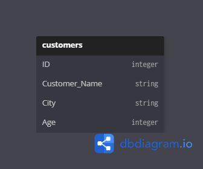
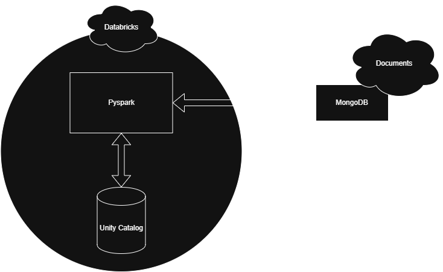

# Coding Questions Project

## Project Overview
This repository documents the ETL and architecture work completed as part of a data engineering practical exercise. The project uses MongoDB for data storage and Databricks Community Edition for serverless compute.

## Key Components
- `notebook.ipynb` — MongoDB-focused notebook containing the MongoDB collection work and related database logic.
- `notebookETL.ipynb` — ETL notebook that includes the Unity Catalog `customer_csv` upload and uses it as part of the ETL process.
- `mongodbCollection.png` — diagram of the MongoDB collection structure.
- `arch.png` — architecture diagram used in the notebook and project design.
- `section3_qa.md` — notes and questions for section 3 practical.

## Tools and Assumptions
- Databricks Community Edition (free) is used for the notebook environment. Access was via https://community.cloud.databricks.com/login.html.
- Draw.io was used to create the architecture diagram (`arch.png`). The tool is available at https://www.drawio.com/.
- https://dbdiagram.io/ was used to create and document the MongoDB collection diagram (`mongodbCollection.png`).
- Serverless compute is used in Databricks Community Edition, so the project relies on MongoDB rather than Spark Maven integration for MongoDB.
- Secrets are not used due to limitations of the free Databricks Community Edition.

## Work Summary
This project includes two distinct notebook workflows:
- `notebook.ipynb` for the MongoDB-related work, including collection design and MongoDB integration.
- `notebookETL.ipynb` for the ETL workflow, which uploads `customer_csv` into Unity Catalog and uses that data as part of the ETL pipeline.

The work covers reading, transforming, and managing data in Databricks, while documenting architecture and practical challenges in the notebook files and supporting diagrams.

## Practical Notes
- Section 3 practical challenges are documented in the notebook `notebookETL.ipynb` and in the separate file `section3_qa.md`.
- The notebooks include notes about the obstacles encountered, such as using serverless compute limitations, avoiding secret management, and adapting MongoDB usage in a free Databricks environment.

## Diagrams
- `mongodbCollection.png` — MongoDB collection diagram from dbdiagram.io.
- `arch.png` — architecture diagram created with draw.io.

### MongoDB Collection Diagram

### Architecture Diagram

## Notes
- The project is designed around the limitations of free Databricks Community Edition and serverless compute.
- Because of these constraints, direct Spark Maven integration for MongoDB was avoided in favor of using MongoDB collection concepts and diagrams.
